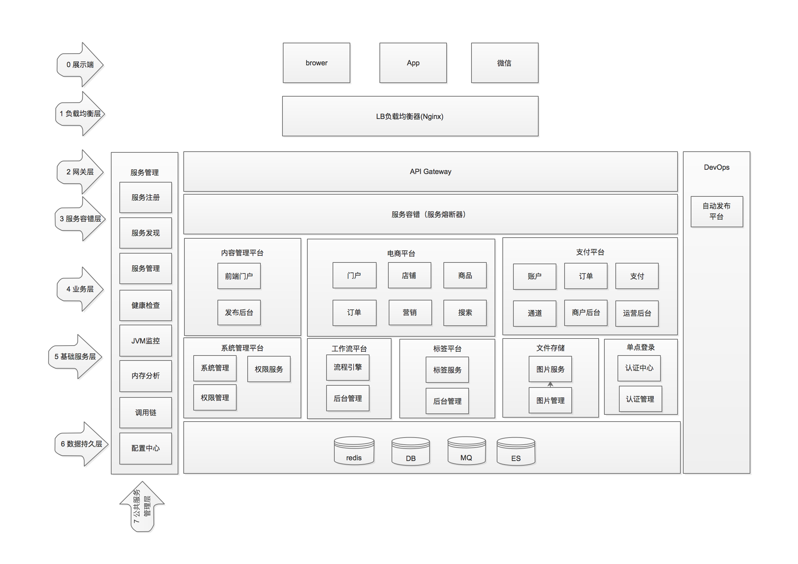
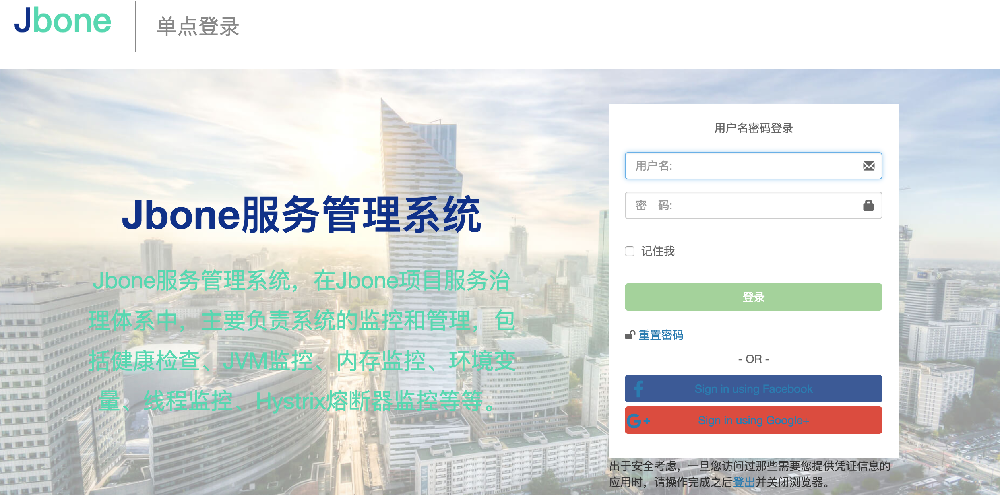
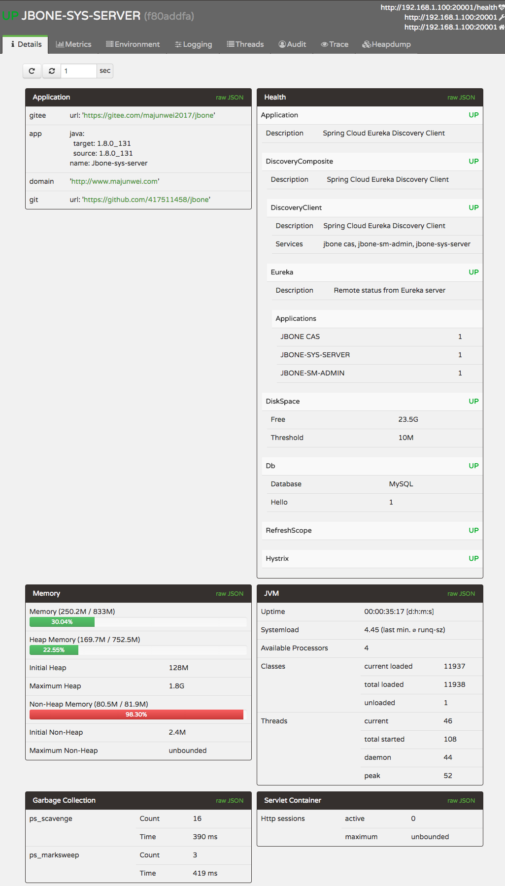
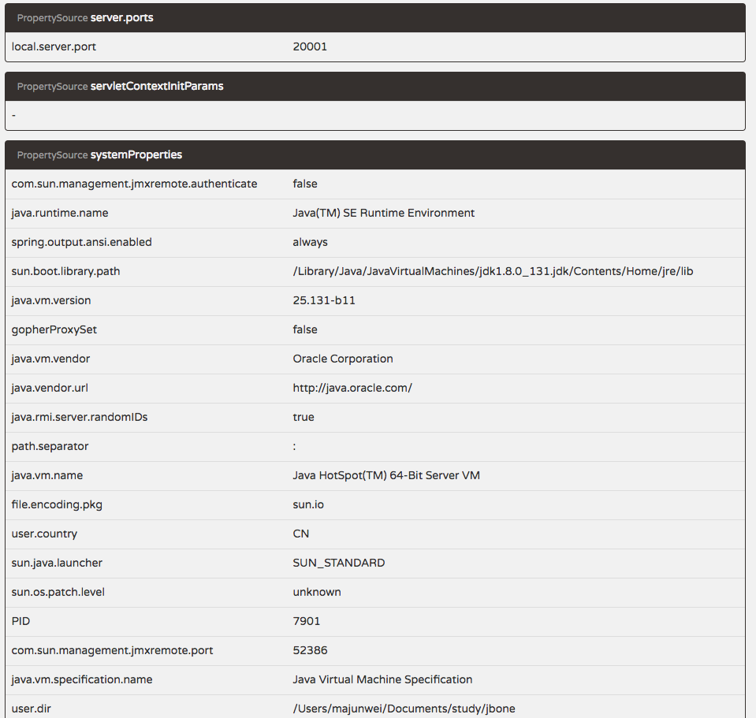
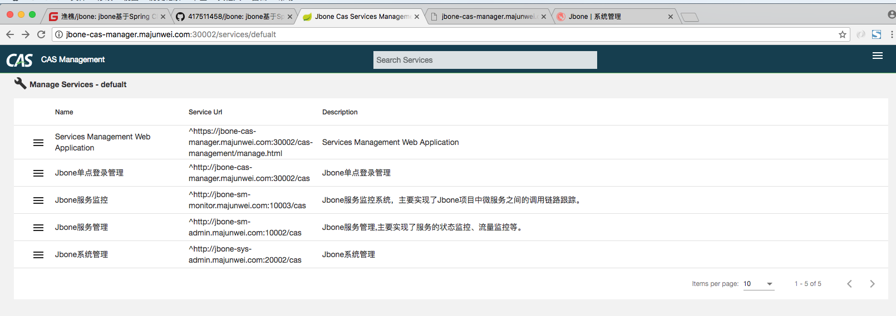
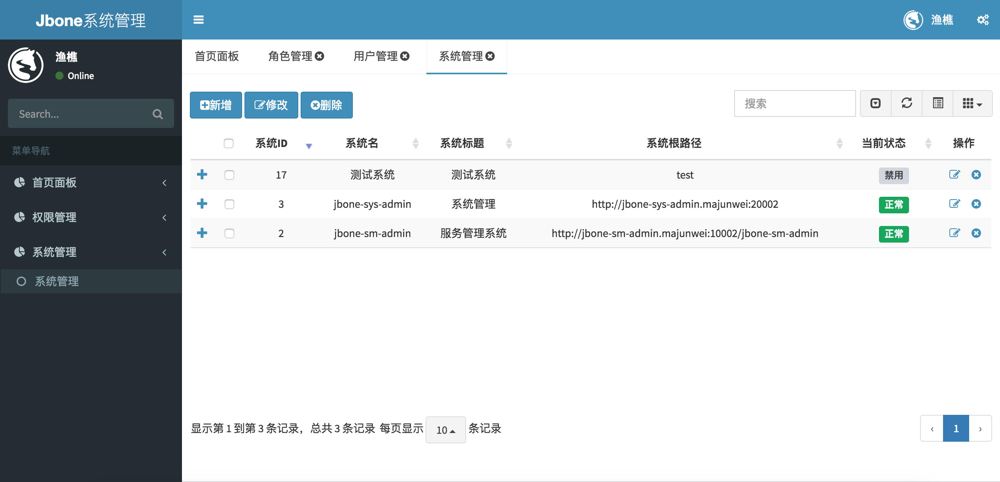

# 概述
## jbone定位
### 学习交流
随着微服务的发展，出现了很多微服务架构的解决方案，Spring Cloud就是其中的典型代表。jbone是基于Spring Cloud搭建的微服务项目，包括服务注册与发现、服务监控、服务管理、服务网关、服务熔断等常见微服务组件。
除Spring Cloud以外，会根据业务特点选择合适的解决方案，如单点登录的CAS、安全框架Shiro等。具体参考《技术选型》。

jbone项目主要关注两个方面的技术交流：
* 功能实现：为技术选型相同的项目，提供实现参考。
* 技术探究：jbone在实现功能的同时，会针对选择的技术框架进行深入探究，使用的同时获得技术提升；出现问题能尽快的定位问题。知道How to use,更要知道How it works。（**技术探究文章在末尾**）
### 造轮子
造轮子的成本非常高，企业快速的业务发展，更想拿来即用。jbone在技术交流的过程中会沉淀出很多轮子，如服务治理、系统管理、内容管理、电商平台等解决方案。使中小企业花最少的成本建立自己的服务治理体系、电商平台、企业管理平台、支付平台等。
## 交流方式
QQ群：547104190

公众号：writebugs

作者QQ：417511458

作者微信：dreamming_now

# 系统设计
## jbone功能架构图


## 项目模块划分
* jbone-cas : 用户单点登录模块
    * jbone-cas-client：客户端jar包，用于集成到需要CAS授权的系统
    * jbone-cas-server：CAS服务端，单独部署，用于完成单点登录、票据管理等
    * jbone-cas-manager：CAS服务管理，用于管理授权服务等
* jbone-sm : 服务管理模块
    * jbone-sm-admin : 服务管理系统，包括服务监控、服务管理等
    * jbone-sm-register : 服务注册中心，原则上所有服务都要注册进来
    * jbone-sm-monitor : 服务监控系统，主要包含服务调用链分析和trace跟踪
* jbone-sys : 系统管理模块
    * jbone-sys-admin ： 系统管理后台
    * jbone-sys-api : 系统服务对外接口定义
    * jbone-sys-api-starter : 基于Spring Cloud Feign的调用实现
    * jbone-sys-core : 系统管理核心
    * jbone-sys-server : 系统管理服务
* jbone-tag ：全平台标签系统
* jbone-cms ：内容管理模块
* jbone-bpm : 工作流模块
* jbone-common : 共用模块
* jbone-configuration : 公共配置模块
* jbone-b2b2c : 多店铺电商平台模块 
* jbone-pay : 支付平台模块
* jbone-im : 即时通信模块
* jbone-ui : 以webjars形式管理前端静态资源，所有包含页面的工程需要依赖此模块。

## 非功能设计
### 可用性
HA >=99.99%（无任何单点问题，对单点故障零容忍）
### 性能设计
RTT < 1S（客户端的感受会受客户机器和网络的影响）

单机QPS：>100（系统容量根据机器的大小伸缩）
### 伸缩性设计
所有系统可以根据访问量，通过添加／减少机器的数量，实现系统伸缩
### 耦合性
所有系统均单独部署，除权限等基础数据外，全都相互隔离
## 技术选型
技术 | 简介 | 网址
---- | ------ | ----
Spring Boot | 基础构建框架，用于快速整合各资源 | [https://projects.spring.io/spring-boot/](https://projects.spring.io/spring-boot/)
Spring Framework | 底层容器 |  [https://projects.spring.io/spring-framework/](https://projects.spring.io/spring-framework/)
Spring Cloud | 微服务框架 | [https://projects.spring.io/spring-cloud/](https://projects.spring.io/spring-cloud/)
Spring Cloud Eureka | 服务注册中心 | [https://projects.spring.io/spring-cloud/](https://projects.spring.io/spring-cloud/)
Spring Cloud Zuul | 服务网关 | [https://projects.spring.io/spring-cloud/](https://projects.spring.io/spring-cloud/)
Spring Cloud Hystrix | 服务容错框架 | [https://projects.spring.io/spring-cloud/](https://projects.spring.io/spring-cloud/)
Spring Cloud Feign | 微服务声明式调用框架 | [https://projects.spring.io/spring-cloud/](https://projects.spring.io/spring-cloud/)
Spring Boot Admin | 服务管理中心 | [https://github.com/codecentric/spring-boot-admin](https://github.com/codecentric/spring-boot-admin)
Spring Data Jpa | 持久化框架 | [https://projects.spring.io/spring-data-jpa/](https://projects.spring.io/spring-data-jpa/)
Spring Data Redis | 缓存框架 | [https://projects.spring.io/spring-data-redis/](https://projects.spring.io/spring-data-redis/)
Apache Shiro | 安全框架 | [http://shiro.apache.org/](http://shiro.apache.org/)
thymeleaf-extras-shiro | thymeleaf的shiro标签 | [https://github.com/theborakompanioni/thymeleaf-extras-shiro](https://github.com/theborakompanioni/thymeleaf-extras-shiro)
Apereo CAS | 单点登陆框架 | [https://github.com/apereo/cas](https://github.com/apereo/cas)
Spring Validator | 后端验证框架 | [https://projects.spring.io/spring-framework/](https://projects.spring.io/spring-framework/)
Hibernate Validator | Hibernate验证框架 | [http://hibernate.org/](http://hibernate.org/)
lombok | 一个通过注解自动生成get/set方法的类库 | [https://projectlombok.org/](https://projectlombok.org/)
webjars | 以jars的形式管理前端静态资源 | [http://www.webjars.org/](http://www.webjars.org/)
Thymeleaf | 模板引擎  | [http://www.thymeleaf.org/](http://www.thymeleaf.org/)
Maven | 项目构建管理  | [http://maven.apache.org/](http://maven.apache.org/)
Redis | 分布式缓存数据库 | [https://redis.io/](https://redis.io/)
Mysql | 对象关系数据库 | [https://www.mysql.com/](https://www.mysql.com/)

# 功能预览
## Jbone CAS(认证中心)
### 实现方式
服务采用Apereo CAS作为登录认证中心，底层集成Shiro，通过Spring Cloud Feign声明式调用权限数据，完成用户授权。
### 定制登录认证页面
考虑到不同系统可能有显示不同风格的登录页面，后端支持配置系统登录皮肤（登录皮肤需要自己开发），也可使用默认视图。

默认视图加载系统的名字和描述信息，以下为登录服务管理系统的视图（登录不同系统会切换视图的展现）：

## Jbone SM Admin(服务管理中心)
### 实现方式
集成Spring Boot Admin 、Spring Cloud Hystrix，完成服务和JVM的监控
### 进入方式
浏览器输入：http://jbone-sm-admin.majunwei.com:100002/admin,跳转至CAS认证中心，输入jbone／jbone，即可进入
### 功能简介
篇幅有限，简单介绍下：

**系统健康概况及内存和JVM概况**



**环境变量**



**Hystrix流量和熔断监控**

## 调用链跟踪
### trace跟踪

### 调用链

## CAS系统管理

## Jbone系统管理
### 系统管理

### 用户管理

### 角色管理

### 菜单管理

### 权限管理

# jbone部署说明(默认HTTP)
## 下载代码
将代码clone下来并导入idea或eclipse；
## 创建数据库
注意要在application.properties里修改自己到数据库用户名和密码
### jbone_sys
创建数据库jbone_sys,并通过doc/jbone_sys.sql创建表和初始化数据；
### jbone_cas
创建数据库jbone_cas,并通过doc/jbone_cas.sql创建表和初始化数据；
### jbone_zipkin（调用链使用）
创建数据库jbone_zipkin,并通过doc/jbone_zipkin.sql创建表和初始化数据；
## 启动redis
安装redis并在本地启动
## 安装并启动RabbitMq(调用链使用)
安装RabbitMq并在本地启动
## 配置域名
```javascript
127.0.0.1 jbone-sm-register.majunwei.com
127.0.0.1 jbone-cas.majunwei.com
127.0.0.1 jbone-sys-server.majunwei.com
127.0.0.1 jbone-sm-admin.majunwei.com
127.0.0.1 jbone-sys-admin.majunwei.com
127.0.0.1 jbone-sm-monitor.majunwei.com
127.0.0.1 jbone-cas-manager.majunwei.com
127.0.0.1 jbone-tag-admin.majunwei.com
127.0.0.1 jbone-eb-portal.majunwei.com
127.0.0.1 jbone-eb-manager.majunwei.com
127.0.0.1 jbone-eb-consumer.majunwei.com
127.0.0.1 jbone-eb-seller.majunwei.com
127.0.0.1 jbone-bpm-admin.majunwei.com
127.0.0.1 jbone-bpm-server.majunwei.com
```

## 启动应用
依次启动：

1. jbone-sm-register（必启）

2. jbone-sys-server（必启）

3. jbone-cas-server（必启）

4. jbone-sys-admin（系统管理）

5. jbone-sm-admin （服务管理）

6. jbone-sm-monitor （服务调用链）

6. jbone-cas-manager （CAS系统管理）

## 进入系统

 系统名称 | 系统地址 
 ---- | ------ 
 系统管理 | http://jbone-sys-admin.majunwei.com:20002/ |
 服务管理 | http://jbone-sm-admin.majunwei.com:10002/ |
 服务调用链 | http://jbone-sm-monitor.majunwei.com:10003/ |
 CAS系统管理 | http://jbone-cas-manager.majunwei.com:30002/ |

默认用户名密码：jbone/jbone

## [https配置方式](doc/https部署.md)


# 技术探究

## Spring Cloud篇
[Eureka实现原理（推荐）](https://mp.weixin.qq.com/s/AhRYd0Iwrxb_nsN4F9E9DQ)

[深入理解Spring Cloud - Spring Cloud Netflix Eureka](http://majunwei.com/view/201808130810451238.html)

[深入理解Eureka-Eureka架构综述](http://www.majunwei.com/view/201808130819216747.html)

[深入理解Eureka-Eureka数据结构](http://www.majunwei.com/view/201808130944142253.html)

[深入理解Eureka-Eureka Register机制](http://www.majunwei.com/view/201808130936271290.html)

[深入理解Eureka-Eureka Renew机制](http://www.majunwei.com/view/201808130925153632.html)

[深入理解Eureka-Eureka Cancel机制](http://www.majunwei.com/view/201808130912315418.html)

[深入理解Eureka-Eureka Evict机制](http://www.majunwei.com/view/201808130902525688.html)

[深入理解Eureka-Eureka Server缓存机制](http://www.majunwei.com/view/201808131007529750.html)

[深入理解Eureka-Eureka Server节点复制机制](http://www.majunwei.com/view/201808130854525492.html)

[深入理解Eureka-Eureka Client获取注册信息机制](http://www.majunwei.com/view/201808131001085867.html)

[深入理解Eureka-Eureka Server自我保护机制](http://www.majunwei.com/view/201808131015366640.html)

[深入理解Eureka-Eureka Region Zone](http://www.majunwei.com/view/201808130953353185.html)

[深入理解Eureka-Eureka配置列表](http://www.majunwei.com/view/201808130827002632.html)

## CAS 篇

[Spring Web Flow - Web流程实现利器](https://mp.weixin.qq.com/s/dDCIdSRW6otFopvS1DDG9g)

[深入理解CAS - CAS票据](http://majunwei.com/view/201807171040041163.html)

[CAS认证和注销过程](http://majunwei.com/view/201807122100410471.html)

[使用spring-boot-admin监控CAS服务](http://majunwei.com/view/201808080954075692.html)


