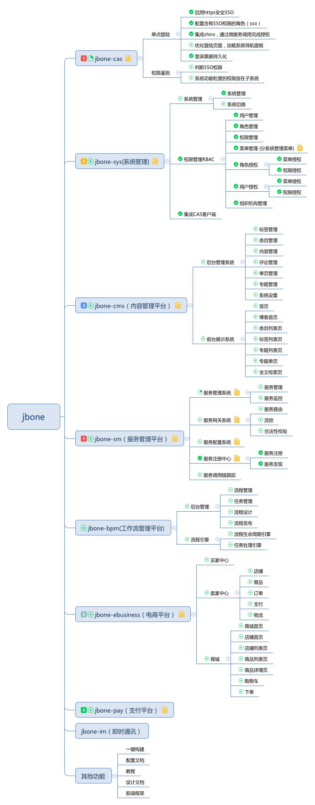
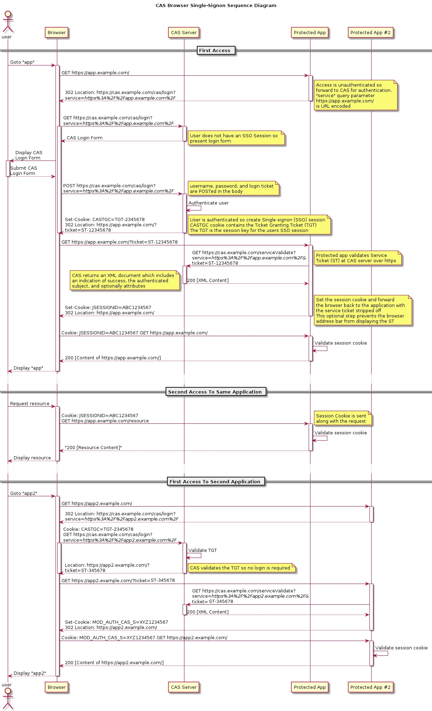

# 概述
## jbone定位
### 对企业
jbone采用微服务架构，为中小企业提供系统管理、内容管理、电商平台等解决方案。使中小企业花最少的成本建立自己的电商平台、企业管理平台、支付平台等。
jbone功能包括服务管理、系统管理平台、内容管理平台、电商平台、支付平台、工作流平台等子系统。
### 对开发
jbone为企业提供解决方案的同时，更重视对前沿技术的学习和探索；jbone使用spring cloud生态体系技术，采用微服务架构，为企业微服务架构提供一种解决方案，供开发人员学习和交流。
其中包括服务注册与发现、服务监控、服务管理、服务治理、服务网关、服务熔断等常见微服务组件。
## 技术交流
QQ群：547104190
# 系统设计
## jbone功能架构图

## jbone物理结构图

## 项目模块划分
* jbone-cas : 用户单点登录模块
    * jbone-cas-client：客户端jar包，用于集成到需要CAS授权的系统
    * jbone-cas-server：CAS服务端，单独部署，用于完成单点登录、票据管理等
    * jbone-cas-manager：CAS服务管理，用于管理授权服务等
* jbone-sm : 服务管理模块
    * jbone-sm-admin : 服务管理系统，包括服务监控、服务管理等
    * jbone-sm-register : 服务注册中心，原则上所有服务都要注册进来
    * jbone-sm-monitor : 服务监控系统，主要包含服务调用链分析和trace跟踪
* jbone-sys : 系统管理模块
    * jbone-sys-admin ： 系统管理后台
    * jbone-sys-api : 系统服务对外接口定义
    * jbone-sys-api-feign : 基于Spring Cloud Feign的调用实现
    * jbone-sys-core : 系统管理核心
    * jbone-sys-server : 系统管理服务
* jbone-tag ：全平台标签系统
* jbone-cms ：内容管理模块
* jbone-bpm : 工作流模块
* jbone-common : 共用模块
* jbone-configuration : 公共配置模块
* jbone-b2b2c : 多店铺电商平台模块 
* jbone-pay : 支付平台模块
* jbone-im : 即时通信模块
* jbone-ui : 以webjars形式管理前端静态资源，所有包含页面的工程需要依赖此模块。
## 电商平台

## 非功能设计
### 可用性
HA >=99.99%（无任何单点问题，对单点故障零容忍）
### 性能设计
RTT < 1S（客户端的感受会受客户机器和网络的影响）

单机QPS：>100（系统容量根据机器的大小伸缩）
### 伸缩性设计
所有系统可以根据访问量，通过添加／减少机器的数量，实现系统伸缩
### 耦合性
所有系统均单独部署，除权限等基础数据外，全都相互隔离
## 技术选型
技术 | 简介 | 网址
---- | ------ | ----
Spring Boot | 基础构建框架，用于快速整合各资源 | [https://projects.spring.io/spring-boot/](https://projects.spring.io/spring-boot/)
Spring Framework | 底层容器 |  [https://projects.spring.io/spring-framework/](https://projects.spring.io/spring-framework/)
Spring Cloud | 微服务框架 | [https://projects.spring.io/spring-cloud/](https://projects.spring.io/spring-cloud/)
Spring Cloud Eureka | 服务注册中心 | [https://projects.spring.io/spring-cloud/](https://projects.spring.io/spring-cloud/)
Spring Cloud Zuul | 服务网关 | [https://projects.spring.io/spring-cloud/](https://projects.spring.io/spring-cloud/)
Spring Cloud Hystrix | 服务容错框架 | [https://projects.spring.io/spring-cloud/](https://projects.spring.io/spring-cloud/)
Spring Cloud Feign | 微服务声明式调用框架 | [https://projects.spring.io/spring-cloud/](https://projects.spring.io/spring-cloud/)
Spring Boot Admin | 服务管理中心 | [https://github.com/codecentric/spring-boot-admin](https://github.com/codecentric/spring-boot-admin)
Spring Data Jpa | 持久化框架 | [https://projects.spring.io/spring-data-jpa/](https://projects.spring.io/spring-data-jpa/)
Spring Data Redis | 缓存框架 | [https://projects.spring.io/spring-data-redis/](https://projects.spring.io/spring-data-redis/)
Apache Shiro | 安全框架 | [http://shiro.apache.org/](http://shiro.apache.org/)
thymeleaf-extras-shiro | thymeleaf的shiro标签 | [https://github.com/theborakompanioni/thymeleaf-extras-shiro](https://github.com/theborakompanioni/thymeleaf-extras-shiro)
Apereo CAS | 单点登陆框架 | [https://github.com/apereo/cas](https://github.com/apereo/cas)
Spring Validator | 后端验证框架 | [https://projects.spring.io/spring-framework/](https://projects.spring.io/spring-framework/)
Hibernate Validator | Hibernate验证框架 | [http://hibernate.org/](http://hibernate.org/)
lombok | 一个通过注解自动生成get/set方法的类库 | [https://projectlombok.org/](https://projectlombok.org/)
webjars | 以jars的形式管理前端静态资源 | [http://www.webjars.org/](http://www.webjars.org/)
Thymeleaf | 模板引擎  | [http://www.thymeleaf.org/](http://www.thymeleaf.org/)
Maven | 项目构建管理  | [http://maven.apache.org/](http://maven.apache.org/)
Redis | 分布式缓存数据库 | [https://redis.io/](https://redis.io/)
Mysql | 对象关系数据库 | [https://www.mysql.com/](https://www.mysql.com/)
## Jbone CAS(认证中心)
### 实现方式
服务采用Apereo CAS作为登录认证中心，底层集成Shiro，通过Spring Cloud Feign声明式调用权限数据，完成用户授权。
### 定制登录认证页面
考虑到不同系统可能有显示不同风格的登录页面，后端支持配置系统登录皮肤（登录皮肤需要自己开发），也可使用默认视图。

默认视图加载系统的名字和描述信息，以下为登录服务管理系统的视图（登录不同系统会切换视图的展现）：

## Jbone SM Admin(服务管理中心)
### 实现方式
集成Spring Boot Admin 、Spring Cloud Hystrix，完成服务和JVM的监控
### 进入方式
浏览器输入：http://jbone-sm-admin.majunwei.com:100002/admin,跳转至CAS认证中心，输入jbone／jbone，即可进入
### 功能简介
篇幅有限，简单介绍下：

**系统健康概况及内存和JVM概况**


**环境变量**


**Hystrix流量和熔断监控**

## 调用链跟踪
### trace跟踪

### 调用链

## CAS系统管理

## Jbone系统管理
### 系统管理

### 用户管理

### 角色管理

### 菜单管理

### 权限管理

## jbone功能和进度表

# jbone部署说明
## 下载代码
将代码clone下来并导入idea或eclipse；
## 创建数据库
注意要在application.properties里修改自己到数据库用户名和密码
### jbone_sys
创建数据库jbone_sys,并通过doc/jbone_sys.sql创建表和初始化数据；
### jbone_cas
创建数据库jbone_cas,并通过doc/jbone_cas.sql创建表和初始化数据；
### jbone_zipkin（调用链使用）
创建数据库jbone_zipkin,并通过doc/jbone_zipkin.sql创建表和初始化数据；
## 启动redis
安装redis并在本地启动
## 安装并启动RabbitMq(调用链使用)
安装RabbitMq并在本地启动
## 配置域名
```javascript
127.0.0.1 jbone-sm-register.majunwei.com
127.0.0.1 jbone-cas.majunwei.com
127.0.0.1 jbone-sys-server.majunwei.com
127.0.0.1 jbone-sm-admin.majunwei.com
127.0.0.1 jbone-sys-admin.majunwei.com
127.0.0.1 jbone-sm-monitor.majunwei.com
127.0.0.1 jbone-cas-manager.majunwei.com
127.0.0.1 jbone-tag-admin.majunwei.com
127.0.0.1 jbone-eb-portal.majunwei.com
127.0.0.1 jbone-eb-manager.majunwei.com
127.0.0.1 jbone-eb-consumer.majunwei.com
127.0.0.1 jbone-eb-seller.majunwei.com
127.0.0.1 jbone-bpm-admin.majunwei.com
127.0.0.1 jbone-bpm-server.majunwei.com
```

## 配置CAS证书

### 配置方式一

1、生成证书
sudo keytool -genkey -alias jbonekeystore -keyalg RSA -keystore /etc/cas/jbonekeystore

注意：要把jbone-cas.majunwei.com填进去；

输入口令：123456

2、导出证书

sudo keytool -export -file /etc/cas/jbonekeystore.crt -alias jbonekeystore -keystore /etc/cas/jbonekeystore

注意：这里输入到是上面设置的密码：123456

3、导入证书到本地JDK（客户端认证）

sudo keytool -import -keystore /Library/Java/JavaVirtualMachines/jdk1.8.0_131.jdk/Contents/Home/jre/lib/security/cacerts -file /etc/cas/jbonekeystore.crt -alias jbonekeystore

注意：

1、这里要找到自己的JDK位置

2、这里的密码输入changeit，信任证书

常见错误：

keytool 错误: java.io.IOException: Keystore was tampered with, or password was incorrect

原因：

输入密码的时候输入changeit

4、配置tomcat SSL

找到server.xml中配置SSL的位置，填写如下内容：
```xml
<Connector port="8443" protocol="org.apache.coyote.http11.Http11NioProtocol" SSLEnabled="true"
               maxThreads="150" scheme="https" secure="true"
               clientAuth="false" sslProtocol="TLS"
               keystoreFile="/etc/cas/jbonekeystore"
               keystorePass="123456" />
```

注意：这里是tomcat8，其他版本的配置方式可能不同，主要表现在protocol属性上。

5、将jbone-cas-server添加到tomcat中，可使用idea部署，或单独启动tomcat部署

常见问题：

Open quote is expected for attribute "keystorePass" associated with an  element type  "Connector".

原因有可能是配置的属性符号问题，比如中文的引号

### 配置方式二：

为了方便开发人员配置证书，我们提供了脚本形式的部署。

- bat脚本： [gencertCasKey.bat](/jbone-cas/jbone-cas-server/src/main/resources/gencertCasKey.bat)
- shell脚本： gencertCasKey.sh 待写

进入到脚本所在路径：
> jbone/jbone-cas/jbone-cas-server/src/main/resources/

找到 `gencertCasKey.bat` 或 `gencertCasKey.sh`

替换脚本中本地JDK密钥库路径

```sh
:: "设置JDK密钥库路径"
set keystoreJDKPath="C:\devSpace\Java\jdk1.8.0_131\jre\lib\security\cacerts "
```

然后执行脚本，根据提示操作即可完成导入。

## 启动应用
依次启动：

1. jbone-sm-register

2. jbone-sm-admin

3. jbone-sys-server

4. jbone-sys-admin

5. jbone-cas-server (支持两种部署方式)

> 单独部署方式：在tomcat单独部署（https端口号8443）

> SpringBootApp方式：将 `jbonekeystore` 放入 `resources` 目录下，直接运行 `CasWebApplication` 主程序

6. jbone-cas-manager(tomcat中运行,http端口号30002)

## 进入系统

 系统名称 | 系统地址 
 ---- | ------ 
 系统管理 | http://jbone-sys-admin.majunwei.com:20002/ |
 服务管理 | http://jbone-sm-admin.majunwei.com:10002/ |
 调用链 | http://jbone-sm-monitor.majunwei.com:10003/ |
 CAS系统管理 | http://jbone-cas-manager.majunwei.com:30002/ |

默认用户名密码：jbone/jbone

# 关键开源技术介绍
## Spring Boot架构图

## Spring Cloud架构图

## Spring Cloud学习资料
[深入理解Spring Cloud - Spring Cloud Netflix Eureka](http://majunwei.com/view/201808130810451238.html)

[深入理解Eureka-Eureka架构综述](http://www.majunwei.com/view/201808130819216747.html)

[深入理解Eureka-Eureka数据结构](http://www.majunwei.com/view/201808130944142253.html)

[深入理解Eureka-Eureka Register机制](http://www.majunwei.com/view/201808130936271290.html)

[深入理解Eureka-Eureka Renew机制](http://www.majunwei.com/view/201808130925153632.html)

[深入理解Eureka-Eureka Cancel机制](http://www.majunwei.com/view/201808130912315418.html)

[深入理解Eureka-Eureka Evict机制](http://www.majunwei.com/view/201808130902525688.html)

[深入理解Eureka-Eureka Server缓存机制](http://www.majunwei.com/view/201808131007529750.html)

[深入理解Eureka-Eureka Server节点复制机制](http://www.majunwei.com/view/201808130854525492.html)

[深入理解Eureka-Eureka Client获取注册信息机制](http://www.majunwei.com/view/201808131001085867.html)

[深入理解Eureka-Eureka Server自我保护机制](http://www.majunwei.com/view/201808131015366640.html)

[深入理解Eureka-Eureka Region Zone](http://www.majunwei.com/view/201808130953353185.html)

[深入理解Eureka-Eureka配置列表](http://www.majunwei.com/view/201808130827002632.html)
## CAS认证过程



