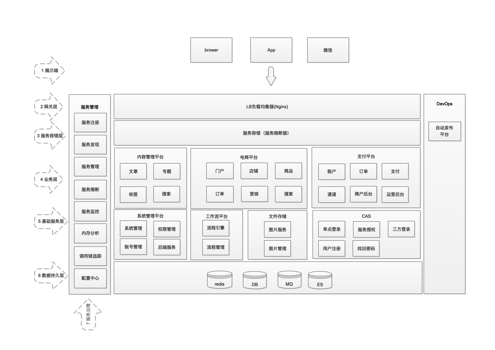
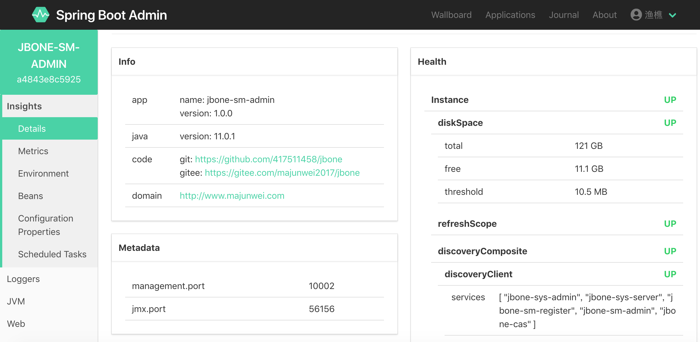
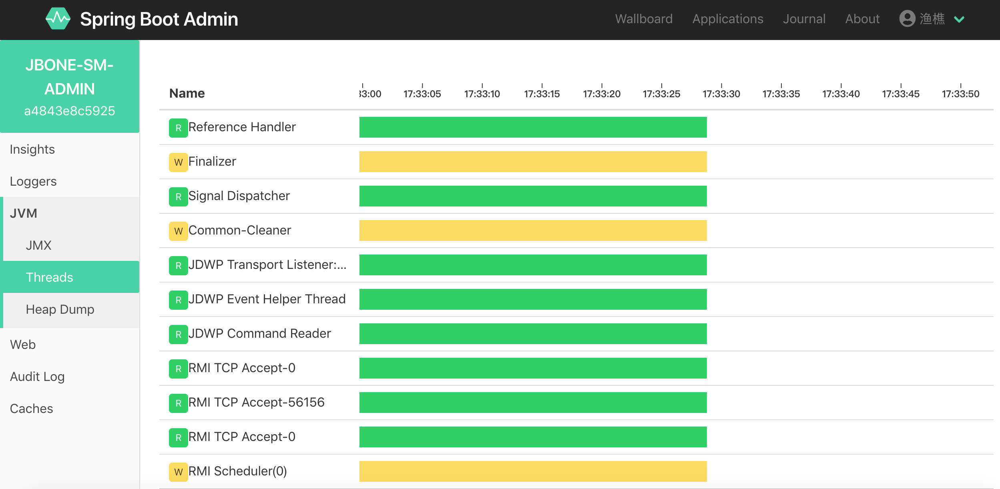
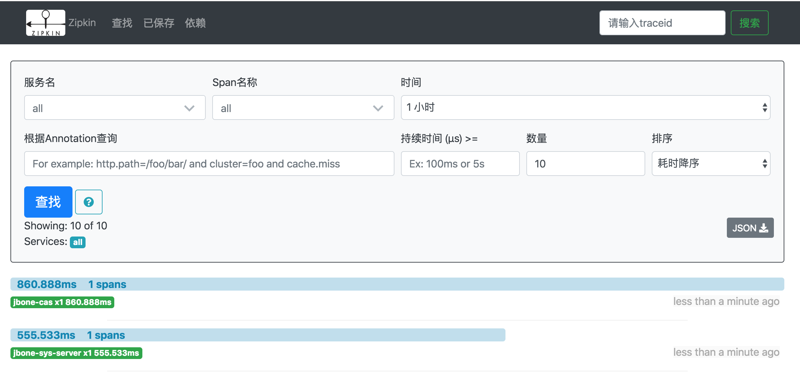
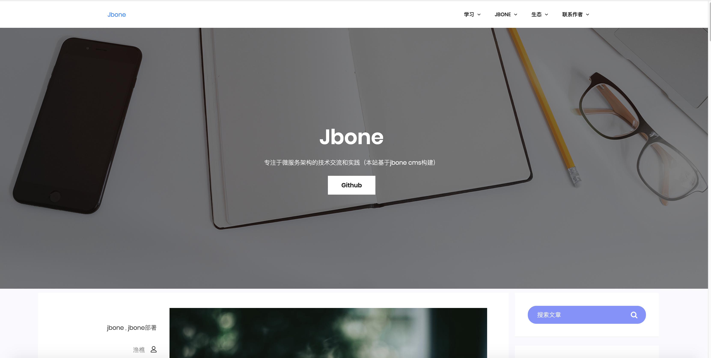
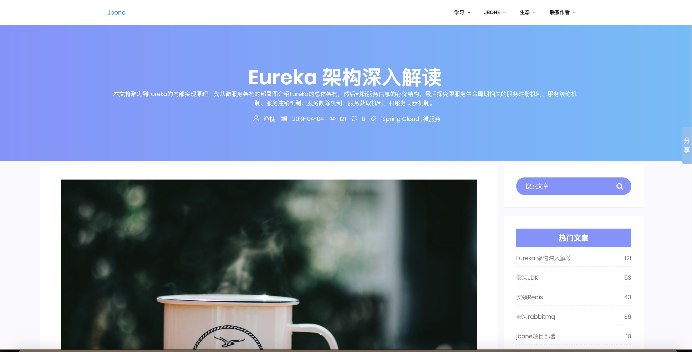
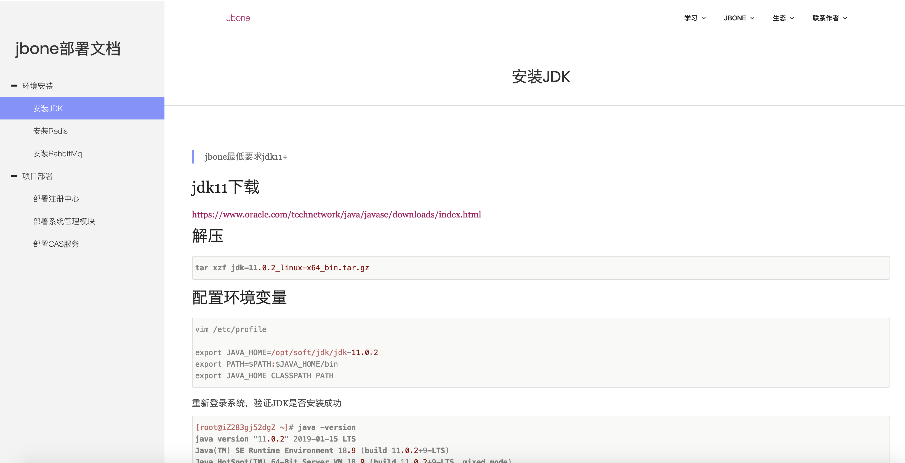
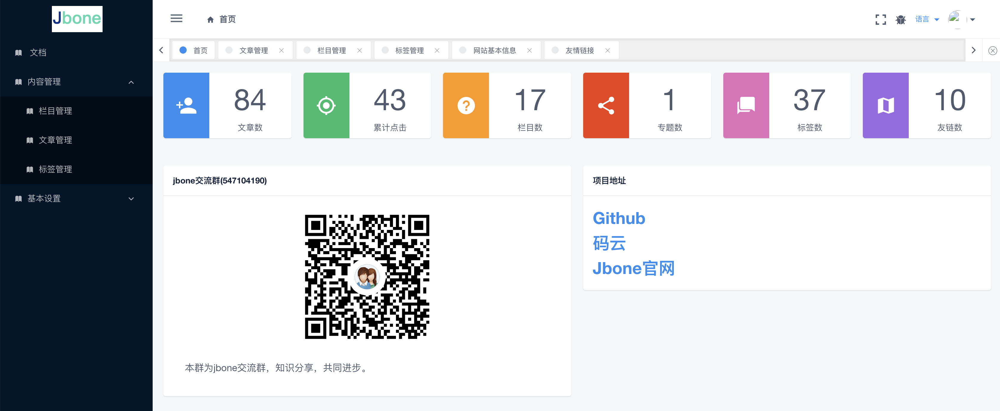

## 强烈推荐Dubbo学习教程：
## [深入剖析Dubbo架构设计和实现原理](https://juejin.cn/book/7069596046602534919)

jbone是基于Spring Cloud开发的项目群，是对Spring Cloud微服务架构的综合应用实践和基础开发框架

[jbone.cn](http://jbone.cn)

**功能架构图**

**项目成员**

项目名 | 简介 | 项目地址
---- | ------ | ----
jbone-sso | 单点登录模块 | [github](https://github.com/417511458/jbone-sso) , [码云](https://gitee.com/majunwei2017/jbone-sso)
jbone-service-management | 服务管理模块(包含注册中心、服务网关、服务监控、调用链追踪等)  |  [github](https://github.com/417511458/jbone-service-management) , [码云](https://gitee.com/majunwei2017/jbone-service-management)
jbone-system | 系统管理模块,通用权限管理等 | [github](https://github.com/417511458/jbone-system) , [码云](https://gitee.com/majunwei2017/jbone-system)
jbone-system-admin | 系统管理后台 | [github](https://github.com/417511458/jbone-system-admin) , [码云](https://gitee.com/majunwei2017/jbone-system-admin)
jbone-fs | 文件系统，用于存储和管理文件、图片等 | [github](https://github.com/417511458/jbone-fs) , [码云](https://gitee.com/majunwei2017/jbone-fs)
jbone-cms | 多站点内容管理系统 | [github](https://github.com/417511458/jbone-cms) , [码云](https://gitee.com/majunwei2017/jbone-cms)
jbone-common | 公共模块，封装工具类等 | [github](https://github.com/417511458/jbone) , [码云](https://gitee.com/majunwei2017/jbone)
jbone-banner | jbone通用艺术banner | [github](https://github.com/417511458/jbone) , [码云](https://gitee.com/majunwei2017/jbone)
jbone-configuration | 公共配置模块 | [github](https://github.com/417511458/jbone) , [码云](https://gitee.com/majunwei2017/jbone)
jbone-ui | 以webjars形式管理前端静态资源，所有包含页面的工程需要依赖此模块。 | [github](https://github.com/417511458/jbone) , [码云](https://gitee.com/majunwei2017/jbone)
jbone-b2b2c | 多店铺电商平台 (未完成) | [github](https://github.com/417511458/jbone-b2b2c) , [码云](https://gitee.com/majunwei2017/jbone-b2b2c)
jbone-bpm | 工作流模块(未完成) | [github](https://github.com/417511458/jbone-bpm) , [码云](https://gitee.com/majunwei2017/jbone-bpm)

# 交流方式

[项目官网](http://jbone.cn)

QQ群：992113778（2群）、547104190（1群）

公众号：writebugs

作者QQ：417511458

作者微信：dreamming_now

微信群：先添加作者好友再加入

# 系统简介

## 系统要求

**JDK11+**

## 技术选型
技术 | 简介 | 网址
---- | ------ | ----
Spring Boot | 基础构建框架，用于快速整合各资源 | [https://projects.spring.io/spring-boot/](https://projects.spring.io/spring-boot/)
Spring Framework | 底层容器 |  [https://projects.spring.io/spring-framework/](https://projects.spring.io/spring-framework/)
Spring Cloud | 微服务框架 | [https://projects.spring.io/spring-cloud/](https://projects.spring.io/spring-cloud/)
Spring Cloud Eureka | 服务注册中心 | [https://projects.spring.io/spring-cloud/](https://projects.spring.io/spring-cloud/)
Spring Cloud Zuul | 服务网关 | [https://projects.spring.io/spring-cloud/](https://projects.spring.io/spring-cloud/)
Spring Cloud Hystrix | 服务容错框架 | [https://projects.spring.io/spring-cloud/](https://projects.spring.io/spring-cloud/)
Spring Cloud Feign | 微服务声明式调用框架 | [https://projects.spring.io/spring-cloud/](https://projects.spring.io/spring-cloud/)
Spring Boot Admin | 服务管理中心 | [https://github.com/codecentric/spring-boot-admin](https://github.com/codecentric/spring-boot-admin)
Spring Data Jpa | 持久化框架 | [https://projects.spring.io/spring-data-jpa/](https://projects.spring.io/spring-data-jpa/)
Spring Data Redis | 缓存框架 | [https://projects.spring.io/spring-data-redis/](https://projects.spring.io/spring-data-redis/)
Apache Shiro | 权限框架 | [http://shiro.apache.org/](http://shiro.apache.org/)
thymeleaf-extras-shiro | thymeleaf的shiro标签 | [https://github.com/theborakompanioni/thymeleaf-extras-shiro](https://github.com/theborakompanioni/thymeleaf-extras-shiro)
Apereo CAS | 单点登陆框架 | [https://github.com/apereo/cas](https://github.com/apereo/cas)
Spring Validator | 后端验证框架 | [https://projects.spring.io/spring-framework/](https://projects.spring.io/spring-framework/)
Hibernate Validator | Hibernate验证框架 | [http://hibernate.org/](http://hibernate.org/)
lombok | 一个通过注解自动生成get/set方法的类库 | [https://projectlombok.org/](https://projectlombok.org/)
webjars | 以jars的形式管理前端静态资源 | [http://www.webjars.org/](http://www.webjars.org/)
Thymeleaf | 模板引擎  | [http://www.thymeleaf.org/](http://www.thymeleaf.org/)
Maven | 项目构建管理  | [http://maven.apache.org/](http://maven.apache.org/)
Redis | 分布式缓存数据库 | [https://redis.io/](https://redis.io/)
Mysql | 对象关系数据库 | [https://www.mysql.com/](https://www.mysql.com/)

## 功能预览
### Jbone CAS(认证中心)

### Jbone SM Admin(服务管理中心)
**系统监控墙**

**系统详情**

**JVM线程监控**

**Hystrix流量和熔断监控**

### 调用链跟踪

### Jbone系统管理
**系统管理**

**用户管理**

**角色管理**

**菜单管理**

**权限管理**

### Jbone CMS（内容管理系统）
**首页**

**文章详情页**

**专题页**

**后台管理**

