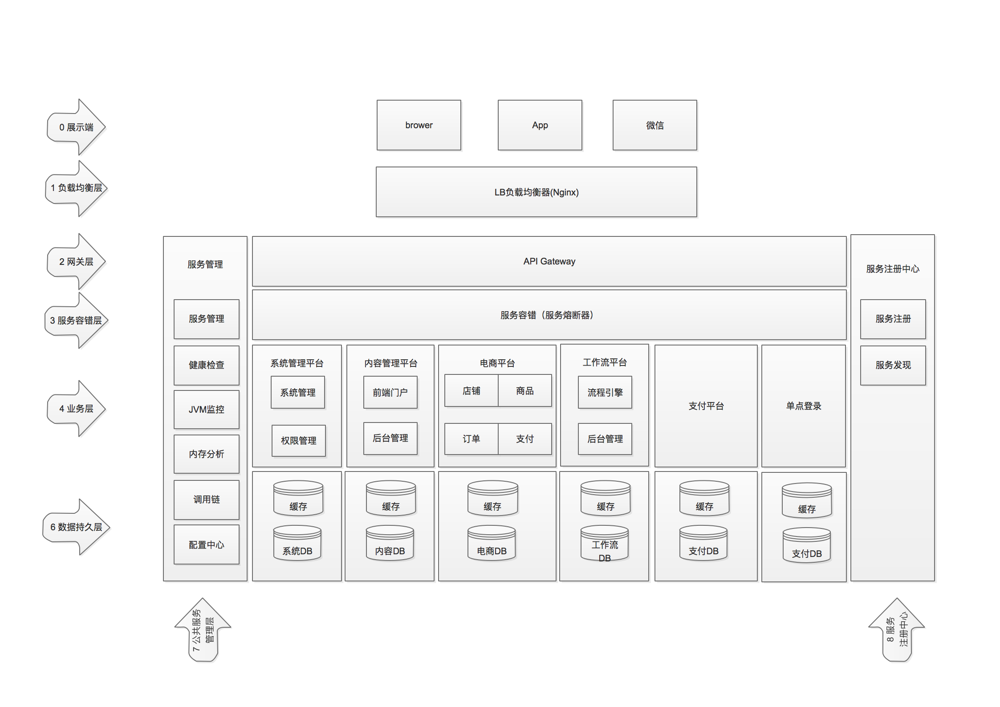
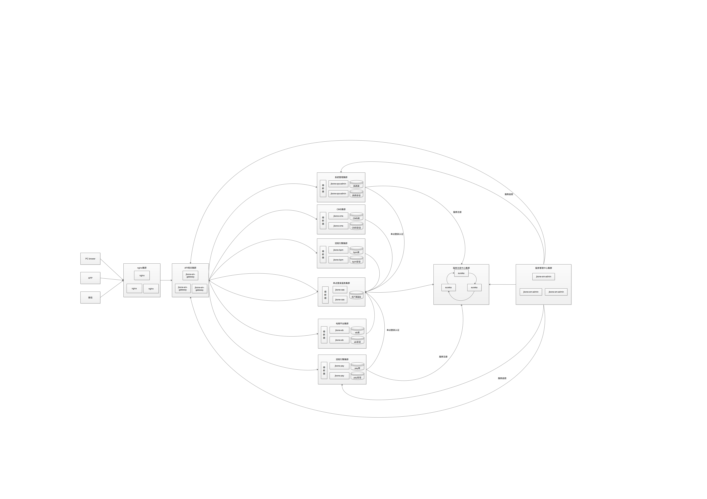
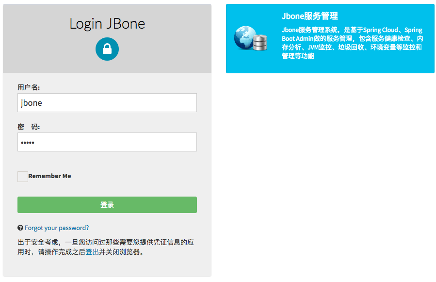

# 概述
## jbone定位
### 对企业
jbone采用微服务架构，为中小企业提供系统管理、内容管理、电商平台等解决方案。使中小企业花最少的成本建立自己的电商平台、企业管理平台、支付平台等。
jbone功能包括服务管理、系统管理平台、内容管理平台、电商平台、支付平台、工作流平台等子系统。
### 对开发
jbone为企业提供解决方案的同时，更重视对前沿技术的学习和探索；jbone使用spring cloud生态体系技术，采用微服务架构，为企业微服务架构提供一种解决方案，供开发人员学习和交流。
其中包括服务注册与发现、服务监控、服务管理、服务治理、服务网关、服务熔断等常见微服务组件。
## 技术交流
QQ群：547104190
# 系统设计
## jbone功能架构图

## jbone物理结构图

## 非功能设计
### 可用性
HA >=99.99%（无任何单点问题，对单点故障零容忍）
### 性能设计
RTT < 1S（客户端的感受会受客户机器和网络的影响）

单机QPS：>100（系统容量根据机器的大小伸缩）
### 伸缩性设计
所有系统可以根据访问量，通过添加／减少机器的数量，实现系统伸缩
### 耦合性
所有系统均单独部署，除权限等基础数据外，全都相互隔离
## 技术选型
技术 | 简介 | 网址
---- | ------ | ----
Spring Boot | 基础构建框架，用于快速整合各资源 | [https://projects.spring.io/spring-boot/](https://projects.spring.io/spring-boot/)
Spring Framework | 底层容器 |  [https://projects.spring.io/spring-framework/](https://projects.spring.io/spring-framework/)
Spring Cloud | 微服务框架 | [https://projects.spring.io/spring-cloud/](https://projects.spring.io/spring-cloud/)
Spring Cloud Eureka | 服务注册中心 | [https://projects.spring.io/spring-cloud/](https://projects.spring.io/spring-cloud/)
Spring Cloud Zuul | 服务网关 | [https://projects.spring.io/spring-cloud/](https://projects.spring.io/spring-cloud/)
Spring Cloud Hystrix | 服务容错框架 | [https://projects.spring.io/spring-cloud/](https://projects.spring.io/spring-cloud/)
Spring Cloud Feign | 微服务声明式调用框架 | [https://projects.spring.io/spring-cloud/](https://projects.spring.io/spring-cloud/)
Spring Boot Admin | 服务管理中心 | [https://github.com/codecentric/spring-boot-admin](https://github.com/codecentric/spring-boot-admin)
Spring Data Jpa | 持久化框架 | [https://projects.spring.io/spring-data-jpa/](https://projects.spring.io/spring-data-jpa/)
Spring Data Redis | 缓存框架 | [https://projects.spring.io/spring-data-redis/](https://projects.spring.io/spring-data-redis/)
Apache Shiro | 安全框架 | [http://shiro.apache.org/](http://shiro.apache.org/)
Apereo CAS | 单点登陆框架 | [https://github.com/apereo/cas](https://github.com/apereo/cas)
Thymeleaf | 模板引擎  | [http://www.thymeleaf.org/](http://www.thymeleaf.org/)
Maven | 项目构建管理  | [http://maven.apache.org/](http://maven.apache.org/)
Redis | 分布式缓存数据库 | [https://redis.io/](https://redis.io/)
Mysql | 对象关系数据库 | [https://www.mysql.com/](https://www.mysql.com/)
## Jbone CAS
### 实现方式
服务采用Apereo CAS作为登录认证中心，底层集成Shiro，通过Spring Cloud Feign声明式调用权限数据，完成用户授权。
### 定制登录认证页面
考虑到不同系统可能有显示不同风格的登录页面，后端支持配置系统登录皮肤（登录皮肤需要自己开发），也可使用默认视图。
默认视图加载系统的名字和描述信息，以下为登录服务管理系统的视图：

## jbone功能和进度表

# 关键开源技术介绍
## Spring Boot架构图

## Spring Cloud架构图

